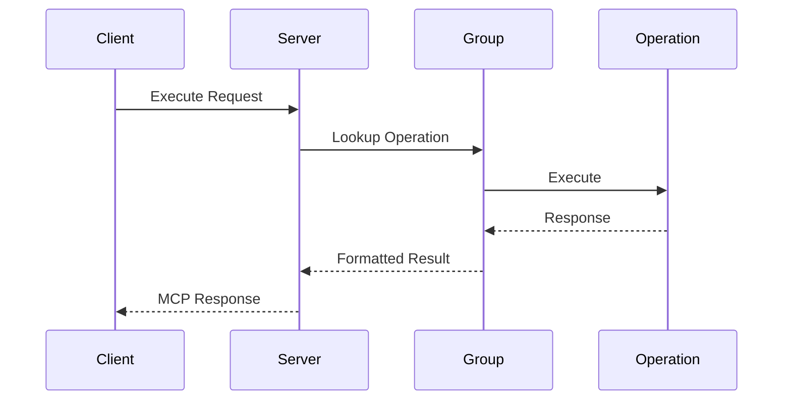
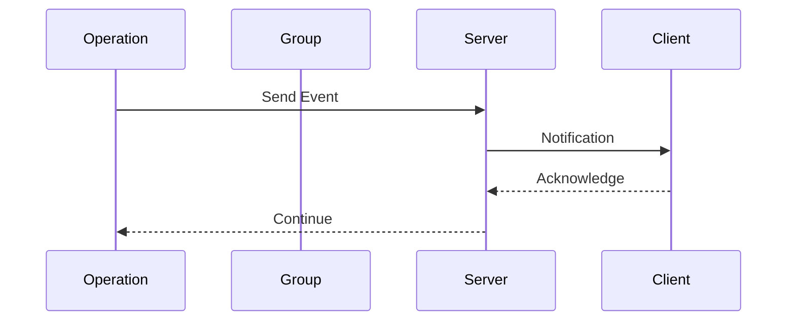

# AutoMCP MCP Implementation

## Core Protocol Implementation

AutoMCP implements the Model Context Protocol (MCP) following the official spec from the Python SDK. The key components include:

### Server Session Management
```python
class AutoMCPServer:
    def __init__(
        self,
        name: str,
        config: ServiceConfig | GroupConfig,
        timeout: float = 30.0,
    ):
        self.name = name
        self.config = config
        self.timeout = timeout
        self.server = Server(name)
        self.groups: dict[str, ServiceGroup] = {}
```

Key aspects:
1. **Single/Multi Group Support**: Can manage both single group and multi-group services
2. **Config-Driven**: Uses Pydantic models for configuration
3. **Timeout Management**: Built-in operation timeouts
4. **Group Registry**: Maintains service group mappings

### Protocol State Machine

```python
async def run(self):
    async with mcp.server.stdio.stdio_server() as (read_stream, write_stream):
        await self.server.run(
            read_stream,
            write_stream,
            InitializationOptions(
                server_name=self.name,
                capabilities=self.get_capabilities()
            )
        )
```

Protocol stages:
1. **Initialization**: Server startup and capability negotiation
2. **Tool Registration**: Operation registration with schemas
3. **Request Processing**: Async operation handling
4. **Result Formatting**: Response preparation per MCP spec

## MCP Core Types

### Service Groups
```python
class ServiceGroup:
    """Base for all service groups."""

    registry: ClassVar[dict[str, Any]] = {}

    async def _execute(
        self, 
        request: ExecutionRequest
    ) -> ExecutionResponse:
        operation = self.registry.get(request.operation)
        if not operation:
            return error_response
        
        try:
            return await operation(
                self, 
                **(request.arguments or {})
            )
        except Exception as e:
            return error_response(str(e))
```

### Operations
```python
@operation(schema=InputModel)
async def process(
    self, 
    input: InputModel
) -> ExecutionResponse:
    """Operation implementation."""
    return ExecutionResponse(
        content=types.TextContent(
            type="text",
            text="Result"
        )
    )
```

## Protocol Message Flow

### 1. Request Flow


### 2. Event Flow


## Essential MCP Types

### 1. Request Types
```python
class ExecutionRequest(BaseModel):
    operation: str
    arguments: dict[str, Any] | None
```

### 2. Response Types
```python
class ExecutionResponse(BaseModel):
    content: types.TextContent
    error: str | None = None
```

### 3. Content Types
```python
class TextContent(BaseModel):
    type: Literal["text"]
    text: str

class BinaryContent(BaseModel):
    type: Literal["binary"]
    data: bytes
```

## Operation Registration Pattern

### 1. Schema Definition
```python
class OperationInput(BaseModel):
    """Input validation schema."""
    name: str
    value: int
```

### 2. Operation Registration
```python
@operation(schema=OperationInput)
async def my_operation(
    self, 
    input: OperationInput
) -> ExecutionResponse:
    # Implementation
    pass
```

## Protocol Capabilities

### 1. Server Capabilities
```python
class ServerCapabilities(BaseModel):
    prompts: PromptsCapability | None = None
    resources: ResourcesCapability | None = None
    tools: ToolsCapability | None = None
    logging: LoggingCapability | None = None
    experimental: dict[str, Any] | None = None
```

### 2. Client Capabilities
```python
class ClientCapabilities(BaseModel):
    sampling: SamplingCapability | None = None
    roots: RootsCapability | None = None
    experimental: dict[str, Any] | None = None
```

## Best Practices

1. **Initialization**
   - Always configure capabilities
   - Validate service configs
   - Handle connection setup/teardown
   - Monitor initialization state

2. **Operation Design**
   - Use clear schemas
   - Implement proper validation
   - Handle operation errors
   - Return formatted responses

3. **Resource Management**
   - Clean up resources
   - Handle context properly
   - Manage async resources
   - Use proper timeouts

4. **Error Handling**
   - Follow MCP error spec
   - Include error context
   - Format error responses
   - Handle async errors

## Testing Strategy

1. **Protocol Testing**
```python
async def test_initialization():
    server = AutoMCPServer(name="test")
    async with server:
        # Test initialization
        capabilities = server.get_capabilities()
        assert capabilities.tools is not None
```

2. **Operation Testing**
```python
async def test_operation():
    request = ExecutionRequest(
        operation="test_op",
        arguments={"x": 1}
    )
    response = await group._execute(request)
    assert not response.error
```

## Related Concepts
- [[MCP Protocol Specification]]
- [[AsyncIO Patterns]]
- [[JSON-RPC]]
